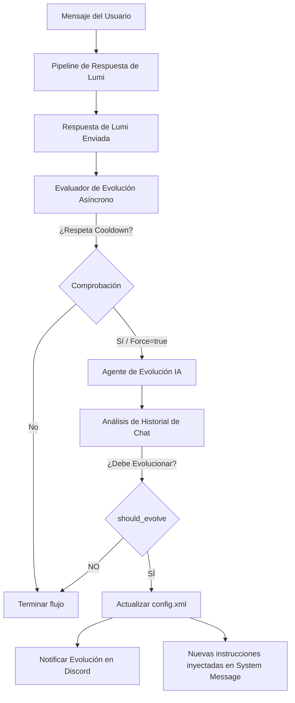

# Evolución Dinámica de Personalidad de Lumi 🌟

El sistema de **Evolución Dinámica de Personalidad** permite que Lumi ("Cute but Psycho", chilena, carismática y algo temperamental) evolucione sus instrucciones de comportamiento y personalidad de forma orgánica a medida que interactúa con los usuarios en los canales de Discord. 

Esta característica evita que sus respuestas se vuelvan repetitivas o estáticas, permitiéndole "recordar" chistes internos, apodos, dinámicas del servidor, preferencias de los usuarios o cambios en su relación con ellos, y adaptar su tono consecuentemente.

---

## 🏗️ Arquitectura del Sistema

El flujo de evolución funciona como un proceso en segundo plano (asíncrono) para no afectar el tiempo de respuesta del bot. Se compone de tres capas principales:



### 1. El Perfil Base Inmutable (`LUMI_INSTRUCTIONS.md`)
Para asegurar que Lumi nunca pierda su esencia básica y sus rasgos distintivos de identidad (como el uso de modismos chilenos, su temperamento cambiante, etc.), mantenemos el archivo principal `LUMI_INSTRUCTIONS.md` como la **identidad base inmutable**. 
Ningún proceso de evolución automática puede alterar este archivo.

### 2. Las Reglas Dinámicas Aprendidas (`config.xml`)
La evolución ocurre exclusivamente sobre el nodo `<personality>` dentro del almacenamiento persistente `config.xml`.
*   Al iniciarse el bot, el `agentManager.js` carga `LUMI_INSTRUCTIONS.md`.
*   Luego consulta `configStore.getPersonality()`.
*   Si existen reglas dinámicas, las concatena al final del system prompt bajo la sección `### REGLAS DE EVOLUCIÓN DINÁMICAS (APRENDIDAS EN CHAT)`.

### 3. El Agente de Evolución (`personalityEvolutionService.js`)
Es un servicio especializado que corre tras bambalinas. Toma las últimas interacciones del canal, el perfil dinámico actual, y realiza una llamada estructurada a la API de Inteligencia Artificial empleando un prompt especializado.

---

## ⏱️ Control de Costos y Tokens (Sistema de Cooldown)

Evaluar la evolución en cada interacción del chat consumiría demasiados recursos de API de forma innecesaria. Por lo tanto, el sistema implementa:

1.  **Cooldown por Canal (Límite de 6 Mensajes):** El servicio rastrea en memoria el conteo de mensajes procesados por cada canal de Discord de forma independiente. Solo cuando se alcanza o supera el umbral (6 mensajes), se gatilla una evaluación real de la IA.
2.  **Evaluación Condicional:** Tras la llamada a la IA, si la conversación carece de información relevante o cambios de comportamiento que justifiquen una evolución, el bot decide no cambiar nada (`<should_evolve>NO</should_evolve>`), evitando actualizaciones innecesarias.
3.  **Forzado de Evaluación (`force: true`):** Útil para propósitos de testing y desarrollo. Permite ignorar el cooldown de mensajes y forzar la llamada de evaluación inmediatamente.

---

## 🧠 El Prompt del Evolution Agent

El Agente de Evolución utiliza un prompt sumamente estricto y especializado, diseñado para mantener coherencia e instrucciones limpias:

*   **Entradas del Prompt:**
    *   **Identidad Base:** Para que entienda quién es Lumi.
    *   **Reglas Dinámicas Actuales:** Las instrucciones aprendidas hasta el momento.
    *   **Historial Reciente del Canal:** Los últimos mensajes del chat que gatillaron la evaluación.
*   **Formato de Salida Obligatorio:** La IA debe responder estrictamente en formato XML empleando las siguientes etiquetas:
    *   `<should_evolve>`: `SI` o `NO` indicando si la conversación amerita un cambio.
    *   `<reason>`: El razonamiento del agente sobre por qué se evoluciona o por qué se decide mantener el estado actual.
    *   `<new_instructions>`: El nuevo conjunto de reglas dinámicas consolidadas (acumula las reglas anteriores relevantes y las nuevas).
    *   `<change_summary>`: Un resumen corto, divertido y con la personalidad "cute but psycho" de Lumi en español de Chile, explicando qué cambió. Este texto es el que se enviará al chat de Discord.

---

## 📂 Formato de Persistencia en `config.xml`

Las instrucciones aprendidas se persisten automáticamente en `config.xml` utilizando el formato clásico de configuración:

```xml
<?xml version="1.0" encoding="UTF-8"?>
<config>
  <!-- ... otras configuraciones de Lumi ... -->
  <personality>
    - Lumi ahora sabe que "yue" la bautizó como "la robot chiquita y tonta". Usará este apodo para burlarse de él de vuelta.
    - Evitará repetir insultos básicos como "tonto" o "feo" y en su lugar usará modismos chilenos más creativos.
  </personality>
</config>
```

---

## 💅 Mensaje de Notificación en Discord

Cuando Lumi evoluciona, el servicio envía automáticamente un mensaje estilizado al canal de Discord activo para que los usuarios sean conscientes de la evolución y se diviertan con ella:

> ✨ **¡Lumi evolucionó!** Ahora la robot chiquita y tonta sabe que el yue le puso ese apodo y lo usará para webearlo. Además, prometo no repetirme tanto con los insultos básicos. 💅

Esto da una sensación de dinamismo único y fomenta que los usuarios sigan chateando e inventando dinámicas con el bot para ver hacia dónde muta su personalidad.
